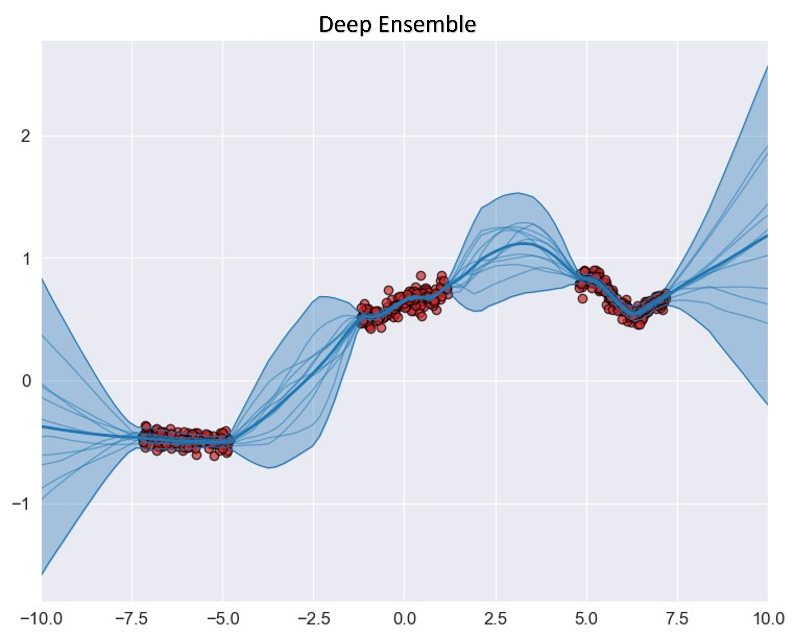

## BatchEnsemble and Anchored Regularization (PyTorch)
This repository presents a PyTorch implementation of BatchLinear as introduced in the *BatchEnsemble* paper by [Wen et al.](https://arxiv.org/abs/2002.06715).  
Additionally, it features a hybrid implementation combining BatchEnsemble with the Anchored regularization method proposed in the *Approximately Bayesian* paper by [Pearce et al.](https://proceedings.mlr.press/v108/pearce20a.html).

## Table Of Contents
 * [Ensemble Background](#Ensemble-Background)
 * [Why BatchEnsemble and Anchored Regularization?](#BatchEnsemble-and-Anchored-Regularization)

## Background
Deep Neural Network (DNNs) are powerful predictors, however, it is not seldom that they produce wrong predictions overconfidently.
Several solutions have been proposed to counteract this behavior, quantifying the uncertainty is one important step. 
Bayesian Neural Networks (BNNs) utilizes methods such as MCMC to place probability distributions over the network weights, although effective for quantifying uncertainty it comes with a huge computational cost. Deep Ensembles were first proposed by [Lakshminarayanan et al.](https://proceedings.neurips.cc/paper_files/paper/2017/hash/9ef2ed4b7fd2c810847ffa5fa85bce38-Abstract.html) as a scaleable non-Bayesian alternative to BNNs for quantifying uncertainty. Deep Ensembles utilizes multiple neural networks independent predictions and lets the variance of the predictions represent the uncertainty of the model.

## BatchEnsemble and Anchored Regularization
Although Deep Ensembles are more scalable than their BNN counterpart, the lack of Bayesian framework has been criticized, additionally a Deep Ensemble's cost for both training and testing increases linearly with the number of ensemble members.

*Anchored Regularization* provides an approximation of Bayesian inference. In our proposed method, we employ the following loss function, incorporating anchored regularization for each ensemble member $j$:

$Loss_j=\frac{1}{N}GNLLL_j+\frac{1}{N}||\pmb{\tau}^{1/2}\cdot(\pmb{\theta}_j-\pmb{\theta}$$anc, j$) $||^2_2$

The right term in the loss function represents the anchored regularization term, where $\pmb{\theta}$$anc, j$ is drawn from a Gaussian distribution:

    $\pmb{\theta}$$anc, j$ $\sim \mathcal{N}(\pmb{\mu}$$prior$$, \pmb{\Sigma}$$prior$)

The left term corresponds to the Gaussian Negative Log-Likelihood Loss (GNLLL), enabling our network to predict both mean and variance terms. This enabled an effective disentanglement of aleatoric and epistemic uncertainties, combining them into a predictive uncertainty

  
   

  <em> &emsp;&emsp;&emsp;&emsp;&emsp;&emsp;&emsp;&emsp;&emsp;&emsp; Naive Ensemble Method &emsp;&emsp;&emsp;&emsp;&emsp;&emsp;&emsp;&emsp;&emsp;&emsp;&emsp;&emsp;&emsp;&emsp;&emsp;&emsp;&emsp;&emsp;&emsp;&emsp;&emsp; Our proposed method.</em>

We leveraged *BatchEnsemble* as a memory efficient way to add ensemble members to an ensemble. This is achieved by defining a weight matrix as the Hardmard product of one shared weight matrix shared among ensemble members and a rank-one matrix per ensemble member: 
$$\bar{W}_i = W \odot F_i, \text{where }F_i=r_is_i^T$$
We assessed our proposed method, incorporating BatchEnsemble, against a Naive ensemble that requires sequential training. The difference in training time becomes substantial as the number of ensemble members increases, as illustrated in the following plot.

  

<em> Training time for different ensemble sizes for our proposed ensemble and the Naive ensemble </em>

